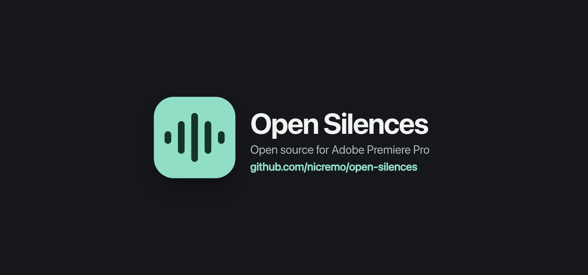
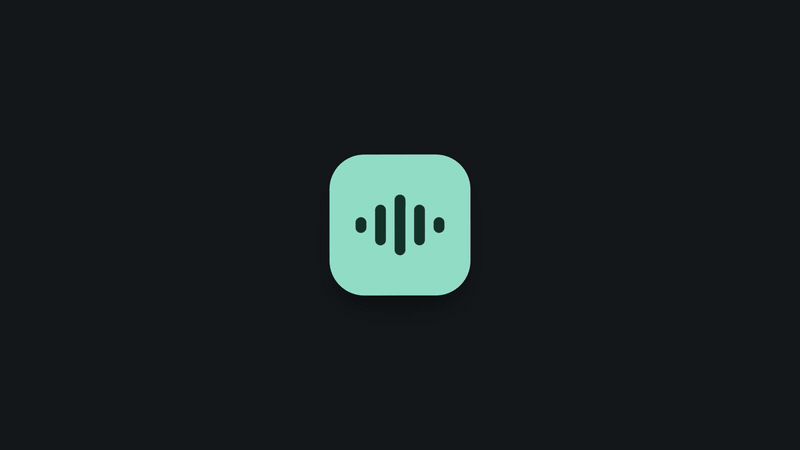
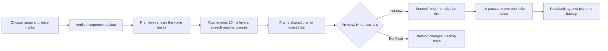

<p align="center">
  <a href="https://github.com/nicremo/open-silences/releases/latest"></a>
</p>

<h1 align="center">Cut the silence. Keep your backup.</h1>

<p align="center">
  <strong>Open Silences is a free, open source silence remover for Adobe Premiere Pro.</strong><br />
  Pick a range and your voice track, check the preview, click once.<br />
  A local Rust engine finds the pauses, Premiere closes the gaps, and a verified backup of your sequence comes first.
</p>

<p align="center">
  <a href="LICENSE"></a>
  <a href="https://github.com/nicremo/open-silences/actions/workflows/checks.yml"></a>
  <a href="package.json"></a>
  
  
  
</p>

<p align="center">
  <a href="#watch">Watch</a> ·
  <a href="#why-open-silences">Why</a> ·
  <a href="#get-started">Get started</a> ·
  <a href="#how-it-works">How it works</a> ·
  <a href="#settings">Settings</a> ·
  <a href="#limits">Limits</a> ·
  <a href="CONTRIBUTING.md">Contribute</a>
</p>

## Watch

<p align="center">
  <a href="https://github.com/nicremo/open-silences/releases/latest"></a>
</p>

<p align="center"><sub>A 16 second launch film. The full quality MP4 with sound is attached to the <a href="https://github.com/nicremo/open-silences/releases/latest">latest release</a>. Panel texts are the real ones, the numbers are an example.</sub></p>

## Why Open Silences

Removing pauses from a talking head video should take one click, not an afternoon, and it should never risk your edit.

- **Free and open source.** MIT licensed. No subscription, no account, no feature gate.
- **Local.** Your audio never leaves your Mac. Premiere renders the selected voice tracks, a Rust engine reads them directly.
- **A backup before every run.** Open Silences duplicates your sequence into a project bin and verifies the copy before it analyses or cuts anything.
- **See it before it happens.** The panel shows how many pauses it found and how much time goes away. Nothing is cut until you click **Cut now**.
- **Speech stays.** Short, loud words such as "ja" or "and" stay. Breaths, clicks and other short quiet noises inside a pause do not count as speech.
- **Only dialogue time is judged.** B-roll and gaps without a dialogue clip are never cut, and cuts shorter than 100 ms are skipped.
- **An automatic threshold.** "Estimate level automatically" finds the gap between your room tone and your quietest syllables and suggests a noise floor in the middle of it.
- **Fast assembly.** Pauses are lifted and every remaining clip moves once, instead of one ripple delete per pause.
- **Verified result.** After the cut every clip position, source range and media reference is read back and compared with the plan.

Open Silences is an independent project. It is not affiliated with or endorsed by Adobe.

## Get started

Open Silences is an alpha for **Premiere Pro 26.5 on Apple Silicon Macs**. The extension is not signed yet, so Premiere needs its developer mode for unsigned extensions once.

1. Download `open-silences-<version>-macos-arm64.zip` from the [latest release](https://github.com/nicremo/open-silences/releases/latest) and unzip it.
2. Allow unsigned extensions for CEP 11 (one time, then restart Premiere):

   ```bash
   defaults write com.adobe.CSXS.11 PlayerDebugMode 1
   ```

3. Copy the `open-silences` folder into your extensions folder and clear the download quarantine, so macOS lets the panel start its unsigned engine:

   ```bash
   cp -R open-silences "$HOME/Library/Application Support/Adobe/CEP/extensions/"
   xattr -dr com.apple.quarantine "$HOME/Library/Application Support/Adobe/CEP/extensions/open-silences"
   ```

4. Open Premiere Pro and choose **Window > Extensions > Open Silences (Alpha)**.

To update, close the panel, replace the folder and open the panel again.

### Build from source

Install the Rust toolchain and Node.js 22 or later.

```bash
git clone https://github.com/nicremo/open-silences.git
cd open-silences
npm run build
```

The package is written to `premiere-plugin/dist/open-silences/`. The build installs nothing and changes no Premiere setting.

## How it works



The detector is specified in [docs/DETECTION.md](docs/DETECTION.md): audible regions above the threshold, short gaps bridged, quiet blips dropped, air kept before and after speech. The planner snaps every cut inward to whole frames, so a cut never reaches into speech. The architecture is described in [docs/ARCHITECTURE.md](docs/ARCHITECTURE.md).

## Settings

The panel speaks English, Spanish and German. It asks for your language the first time it opens, and the globe menu at the top changes it any time. All settings stay on your computer.

| Setting | Default | Meaning |
| --- | --- | --- |
| Noise floor | -45 dB | Audio below this level counts as silence. "Estimate level automatically" suggests a value for your recording. |
| Silence from | 160 ms | Shorter pauses stay. |
| Speech from | 160 ms | Shorter, quiet sounds do not count as speech. Short loud words stay. |
| Air before speech | 160 ms | Audio kept before speech starts. |
| Air after speech | 160 ms | Audio kept after speech ends. |

Pacing presets from **Standard** to **Very tight** set the four timing values at once.

## Limits

| Area | Current scope |
| --- | --- |
| Operating system | macOS on Apple Silicon |
| Premiere Pro | 26.5.x |
| Frame rates | 25 and 59.94 fps |
| Integration | CEP panel and ExtendScript; native cutting uses the undocumented QE API |
| Timeline | Speed changes, reversed or nested clips, transitions and locked content stop the cut instead of being guessed |

Audio export and cutting block Premiere for a moment and cannot be cancelled. A failed cut may leave a partly edited sequence; the named backup is there to restore it. Windows and other frame rates are not supported yet. More detail in the [panel README](premiere-plugin/README.md) (German).

## Privacy

No network access is needed. Open Silences keeps run evidence (the rendered WAV, the snapshot and the engine output) in your temporary folder under `open-silences-evidence` so a failed run can be debugged. Delete it whenever you like.

## Verify

```bash
cargo test --release --locked --manifest-path premiere-plugin/engine/Cargo.toml
cargo clippy --locked --all-targets --manifest-path premiere-plugin/engine/Cargo.toml -- -D warnings
npm test
```

FFmpeg is needed for the synthetic test fixtures. CI runs these checks on Linux and macOS. Passing CI does not prove Premiere compatibility; that needs a live test in Premiere.

## Project layout

| Path | Purpose |
| --- | --- |
| `premiere-plugin/engine/` | Rust engine: PCM reader, block levels, pause detector, cut planner, CLI |
| `premiere-plugin/panel/` | CEP panel, workflow and ExtendScript host adapter |
| `premiere-plugin/test/` | Panel, wire, package and engine protocol tests |
| `premiere-plugin/install/` | Package builder |
| `docs/` | Detector specification, architecture, provenance, release checklist |

## Contributing and license

Contributions are welcome. Read [CONTRIBUTING.md](CONTRIBUTING.md) first; host changes need a test with synthetic media in Premiere.

Open Silences is released under the [MIT license](LICENSE). Third-party components keep their own terms: the Adobe CSInterface bridge ships under the Adobe General SDK License, JSON2 is in the public domain. See [THIRD-PARTY.md](THIRD-PARTY.md). Adobe and Premiere Pro are trademarks of Adobe.

Made by [Fabian Bitzer](https://github.com/nicremo).
