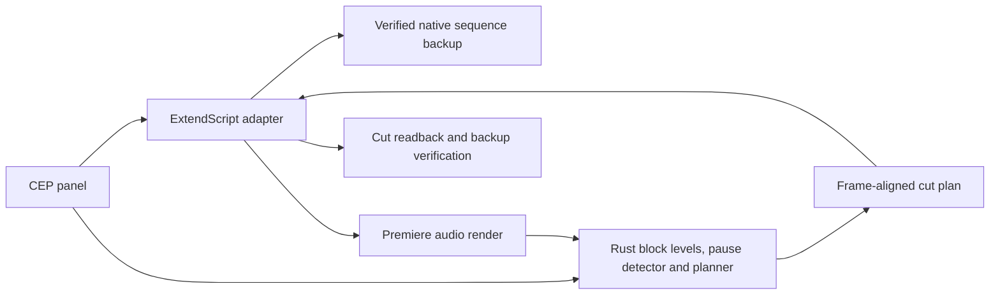

# Architecture

The CEP panel owns the user workflow and launches the local Rust engine. Its copy lives in `panel/js/i18n.js` (English, Spanish, German); everything below the panel, host replies and engine errors, is written in English. ExtendScript reads and changes Premiere state. The engine receives explicit snapshots and produces plans using integer tick strings.

The pause detector is specified in `docs/DETECTION.md` and implemented in the engine from that document. When a plan is applied, the ExtendScript adapter indexes the plan and the timeline once per run instead of rescanning both for every cut.

Cuts are assembled without one ripple per pause: the adapter lifts every pause and then moves each remaining item once by the time removed before it. The engine supplies that time per interval as exact ticks. The previous ripple assembly is kept as `assembly: 'ripple'`. The final readback is the same for both paths.

The workflow rechecks identity and state before analysis and mutation. The adapter creates a backup before either operation. Selected audio is exported through a native analysis copy. A second export checks the current audio mix before applying a plan. Native partition readback verifies the source continuity before deleting pieces. Final readback verifies positions, source ranges and the unchanged backup.

The adapter embeds JSON2 because a fresh ExtendScript context can lack JSON. Startup cannot depend on another extension supplying it.

The native cut path uses the undocumented QE API, which limits supported Premiere versions and frame rates. Host mutation is not transactional. On failure, retain the named backup and report the incomplete operation; do not retry a mutation automatically.

## Agent CLI

The package contains a second, invisible CEP extension (`de.fabian.open-silences.bridge`). It starts when Premiere activates, loads the same ExtendScript adapter and serves a file queue in `~/Library/Application Support/open-silences/bridge/`. A command names one of the six host calls; raw ExtendScript is rejected. Commands are claimed by an atomic rename, run one at a time, and answered with the unchanged host text. Commands older than two minutes are refused.

The CLI in `cli/` runs `createWorkflow` from the panel with this queue as host and the bundled engine as engine. `--yes` replaces the confirmation click. A call without a reply is reported as an unknown outcome and never retried. Usage: `docs/CLI.md`.
